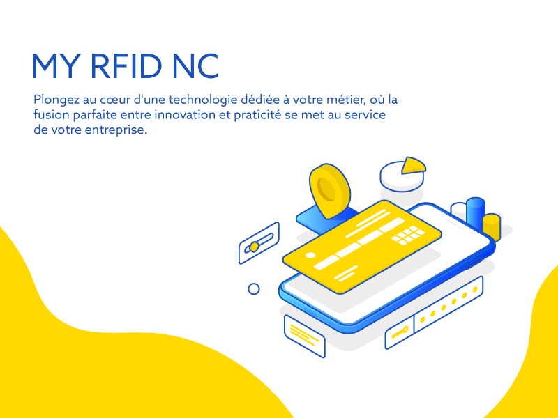

# MY RFID NC 📡

Bienvenue sur le dépôt GitHub de **MY RFID NC**! Basée en Nouvelle-Calédonie, notre entreprise est spécialisée dans la proposition de solutions innovantes utilisant la technologie RFID.

---

## 📌 À propos

**MY RFID NC**, en partenariat avec **Famoko**, offre une panoplie de solutions basées sur la technologie RFID:

- **Système de pointage des employés**: Gardez une trace précise des heures de travail de vos employés.
- **Gestion du ménage**: Idéale pour les hôtels et les entreprises de nettoyage, pour assurer un service de qualité.
- **Gestion des tickets de transport**: Simplifiez vos systèmes de transport avec des solutions rapides et sans contact.
- **Livraison de journaux**: Assurez une livraison précise et à temps avec le suivi RFID.

Avec les données que nous collectons, nous offrons la possibilité d'extraire des informations pertinentes et de fournir à nos clients des tableaux de bord pour piloter efficacement leur entreprise. Nous proposons également des solutions sur mesure selon les besoins spécifiques de nos clients.

---

## 🚀 Caractéristiques

- **Innovant** : Utilise les dernières technologies RFID pour fournir des solutions efficaces.
- **Fiable** : Testé et approuvé par de nombreux utilisateurs.

---

## 📞 Contact

Si vous avez des questions ou des suggestions, n'hésitez pas à nous contacter à [email@address.com](mailto:email@address.com).

---

## ⚖️ Licence

Ce projet est sous licence MIT. Voir le fichier [LICENSE](LINK-TO-LICENSE.md) pour plus de détails.

